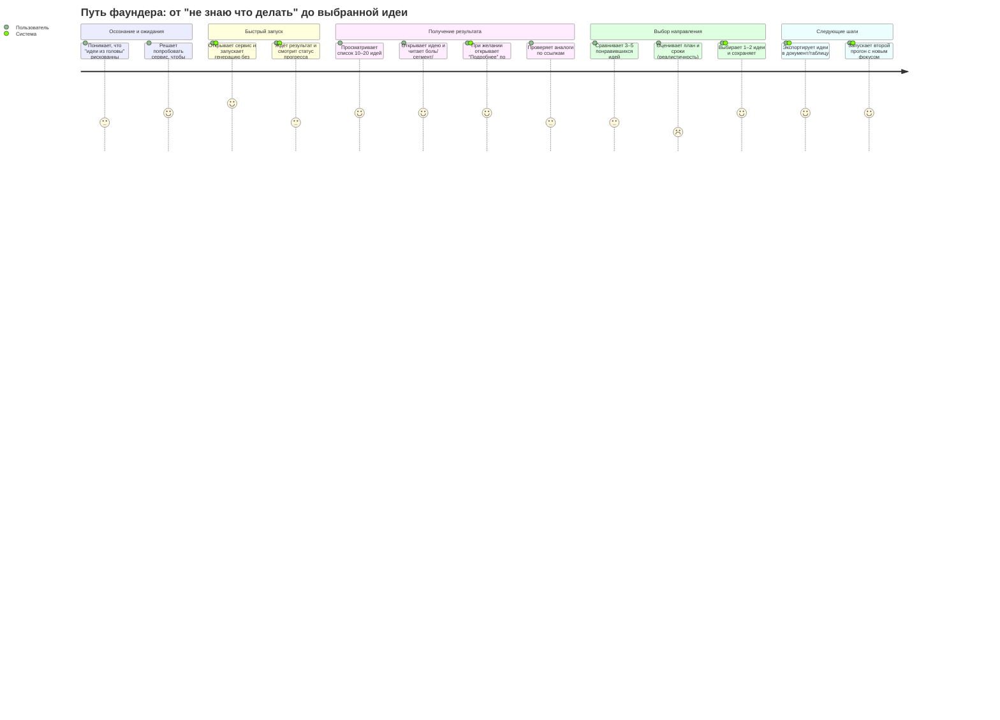

# User Journey Map: Генератор болей → выбор бизнес-идеи

> Персона: Иван, 27 лет, участник AI Talent Camp (фаундер-одиночка)
> Цель: за 1–2 часа выбрать 1–2 направления и начать проверку спроса (при этом “первую рабочую версию” сервиса можно собрать за 1 день)
> Основано на: Brief v1.0, User Story Map v1.0

---

## Диаграмма

---

## Анализ по фазам

### Осознание и ожидания

| Действие | Score | Почему такая оценка | Pain Points |
|----------|-------|---------------------|-------------|
| Понимает, что "идеи из головы" рискованны | 3 | Есть мотивация, но нет ясного способа | Неясно, где искать «реальные боли» |
| Решает попробовать сервис | 4 | Обещание “idea pack за один прогон” снижает порог | Сомнение в качестве / “очередной генератор идей” |

**Что думает пользователь:** "Если это реально даст 1–2 идеи с аналогами и планом, я сэкономлю дни."

---

### Быстрый запуск

| Действие | Score | Почему такая оценка | Pain Points |
|----------|-------|---------------------|-------------|
| Запускает генерацию без настроек | 5 | Соответствует ожиданию «без лишних вопросов» | — |
| Ждёт результат и смотрит статус | 3 | Ожидание неизбежно, важно объяснение | Тревога: “а что там происходит?” |

**Что думает пользователь:** "Ок, пусть думает. Главное — чтобы не тянулось вечность."

---

### Получение результата

| Действие | Score | Почему такая оценка | Pain Points |
|----------|-------|---------------------|-------------|
| Просматривает список идей | 4 | Быстрое сравнение, карточки помогают | Перегруз: 20 идей = сложно выбрать |
| Читает боль/сегмент/уверенность | 4 | Структура помогает понимать | Если формулировки общие — доверие падает |
| Проверяет аналоги по ссылкам | 3 | Полезно, но требует времени | Аналоги могут быть нерелевантны/устареть |
| Открывает “Подробнее” (цитаты/ссылки) | 4 | Увеличивает доверие, но не обязателен | Если слишком много — перегруз |

**Что думает пользователь:** "Покажи, что это реально и кто уже так делает."

---

### Выбор направления

| Действие | Score | Почему такая оценка | Pain Points |
|----------|-------|---------------------|-------------|
| Сравнивает идеи | 3 | Требуются критерии выбора | Нет “рамки решения”: что важнее — рынок, скорость, интерес |
| Оценивает план и сроки | 2 | Самая важная часть, даже “скелет” должен быть понятен | План может быть непонятным даже на уровне наброска |
| Выбирает и сохраняет | 4 | Хорошее завершение, фиксирует результат | — |

**Что думает пользователь:** "Ок, а это реально сделать одному за неделю/месяц?"

---

### Следующие шаги

| Действие | Score | Почему такая оценка | Pain Points |
|----------|-------|---------------------|-------------|
| Экспортирует в документ/таблицу | 4 | Помогает обсудить с менторами/командой | Формат экспорта должен быть удобным |
| Делает второй прогон | 4 | Помогает расширить поле вариантов | Риск повторов и падение новизны |

---

## Выявленные проблемы

### Критические (Score 1-2)

| # | Фаза | Действие | Проблема | Влияние |
|---|------|----------|----------|---------|
| 1 | Выбор направления | Оценивает план и сроки | План может быть слишком общим/непроверяемым | Пользователь не может принять решение, уходит |

### Gaps в User Story Map

| # | Что отсутствует | Где должно быть | Рекомендация |
|---|-----------------|-----------------|--------------|
| 1 | Явная “рамка выбора” (критерии сравнения) | EPIC-004 | Добавить истории про сравнение по “скорость/рынок/личный интерес/риск” |
| 2 | Явная прозрачность доказательств | EPIC-002 | Делать “паттерны” по умолчанию + “Подробнее” для ссылок/цитат |

---

## Рекомендации по доработке USM

### Приоритет 1 (Критично)

- [ ] **[EPIC-003]:** Стандартизировать “план и сроки” как **очень простой скелет** (7/30 дней) для Day‑1 MVP; чеклисты и критерии готовности — позже.
- [ ] **[EPIC-002]:** Добавить объяснение «почему это боль» (сигналы/паттерны) как обязательное поле в карточке идеи.

### Приоритет 2 (Важно)

- [ ] **[EPIC-004]:** Добавить “рамку выбора” (простая матрица сравнения) и сохранение 1–2 финалистов.

---

## Метрики

- **Средний score:** 3.7 / 5
- **Критических точек (score ≤ 2):** 1
- **Самая слабая фаза:** Выбор направления (avg: 2.7)
- **Самая сильная фаза:** Быстрый запуск (avg: 4.0)

---

## Следующие шаги

1. [ ] Уточнить формат «плана и сроков» (что считать “достаточно конкретным”).
2. [ ] Добавить “рамку выбора” (критерии сравнения идей) в MVP или сразу после MVP.
3. [ ] Пересмотреть journey после появления сравнения/прозрачности.
