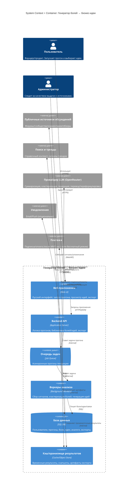

# C4 Architecture: Генератор болей → бизнес-идеи

> Версия: 1.0  
> Дата: 2026-02-03  
> Основано на: Brief v1.0, USM v1.0, NFR v1.0

## 1. Обзор системы

**Назначение:** сгенерировать **idea pack из 10–20 бизнес‑идей** (на русском) для быстрого выбора 1–2 вариантов: каждая идея включает **сигналы/доказательства боли**, **аналоги** и **план + сроки (7/30 дней)**, с **уровнем уверенности**, без длинного интервью с пользователем.  
**Ключевые пользователи:** Гость, Пользователь (Фаундер/Продакт), Администратор (внутренний).  
**Ограничения MVP:** первая рабочая версия за 1 день; бюджет на модели — только уже оплаченный OpenRouter; остальное — локально/бесплатно по возможности.  
**Внешние зависимости (категориями):**
- Источники публичных обсуждений (форумы/сообщества/площадки с комментариями)
- Поисковые/тренд‑источники (для контекста и аналогов)
- Провайдер LLM/моделей (через OpenRouter) + (опционально) локальная обработка простых шагов
- Почта/уведомления (опционально)
- Платежи/биллинг (после MVP)

## 2. Архитектурная диаграмма

## 3. Описание компонентов

### Контейнеры

| Контейнер | Технология | Назначение | Масштабирование |
|-----------|------------|------------|-----------------|
| Веб‑приложение | Web UI | Запуск прогонов, просмотр идей, сравнение, экспорт | По трафику |
| Backend API | App Server | Оркестрация прогонов, доступ к библиотеке, экспорт | По трафику |
| Очередь задач | Job Queue | Асинхронные прогоны | По количеству задач |
| Воркеры анализа | Background | Сбор сигналов, обработка, генерация | Горизонтально (NFR: важно) |
| База данных | SQL DB | Хранение результатов и истории | Вертикально/реплика (по росту) |
| Кэш/хранилище | Cache/Object | Промежуточные/крупные артефакты | По объёму |

### Внешние системы

| Система | Назначение | Интеграция | Fallback |
|---------|------------|------------|----------|
| Публичные источники | Сигналы болей и паттерны | Web/API | Использовать альтернативные источники / уменьшить охват |
| Поиск и тренды | Контекст и аналоги | Web/API | Кэш + “меньше аналогов, но честно” |
| Провайдер LLM | Синтез и генерация | API | Деградация качества: меньше идей/более шаблонно |

## 4. Потоки данных

### Основной поток (прогон)
Пользователь → Веб → API → Очередь → Воркеры → (Источники/Поиск/LLM) → БД → API → Веб → Экспорт

### Асинхронные операции
API → Очередь → Воркеры → обновление статуса прогона → уведомление (опционально)

## 5. Ключевые решения (на уровне категорий)

| Решение | Выбор | Почему | Альтернативы |
|---------|-------|--------|--------------|
| Генерация “не ждать UI” | Асинхронный прогон | NFR: прогон может занимать минуты | Только синхронно (плохой UX) |
| Прозрачность | Хранить “сигналы”/обоснование | Доверие и повторяемость | Только итоговый текст (низкое доверие) |
| Масштабирование | Воркеры отдельно | Нагрузка концентрируется на анализе | Всё в API (риски по latency) |

## 6. Нерешённые вопросы

- [ ] Политика “Подробнее”: какие именно детали показываем (ссылки на обсуждения, обезличенные цитаты, метаданные), и где проходит граница “не перегружаем”.
- [ ] Нужен ли режим “для компании с данными” (тикеты/отзывы) как отдельный контейнер/поток? (в Day‑1 MVP исключён)
