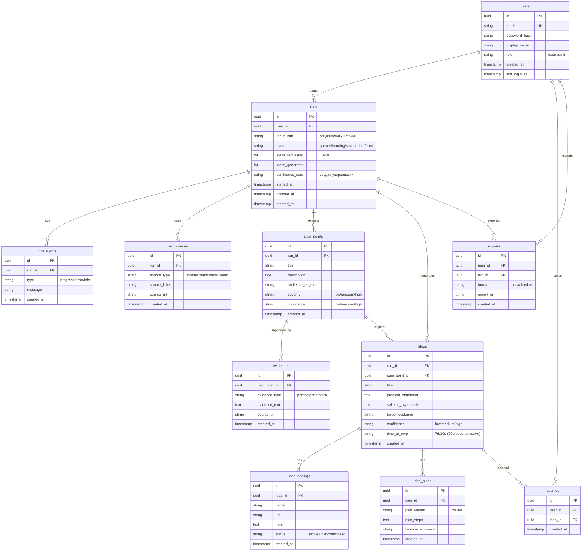

# Data Model: Генератор болей → бизнес-идеи

> Версия: 1.0  
> Основано на: Brief v1.0, USM v1.0  

## 1. Обзор

**Всего сущностей (ядро):** ~12 (без справочников)  
**Тип хранения:** SQL‑модель (концептуально)

### Группы
- **Core:** users, sessions (опционально), user_settings
- **Runs:** runs, run_events, run_sources
- **Insights:** pain_points, evidences
- **Ideas:** ideas, idea_analogs, idea_plans
- **User actions:** favorites, exports
- **Reference:** tags (опционально)

## 2. ER-диаграмма

## 3. Описание сущностей (коротко)

### `runs`
**Назначение:** единица “прогона” генерации. Хранит статус, фокус, метрики результата.

### `pain_points` + `evidences`
**Назначение:** боли и их “обоснования” (для доверия и прозрачности).

### `ideas` + `idea_analogs` + `idea_plans`
**Назначение:** итоговые бизнес‑идеи, аналоги с ссылками и план/сроки.

## 4. Связи

| Связь | Тип | Описание | Каскад |
|-------|-----|----------|--------|
| users → runs | 1:N | пользователь запускает прогоны | удалить прогон при удалении пользователя (по политике) |
| runs → pain_points | 1:N | прогон извлекает боли | да |
| pain_points → evidences | 1:N | доказательства боли | да |
| runs → ideas | 1:N | прогон генерирует идеи | да |
| ideas → analogs/plans | 1:N | детали идеи | да |

## 5. Миграции (порядок)

1. users
2. runs
3. pain_points, evidences
4. ideas, idea_analogs, idea_plans
5. favorites, exports
