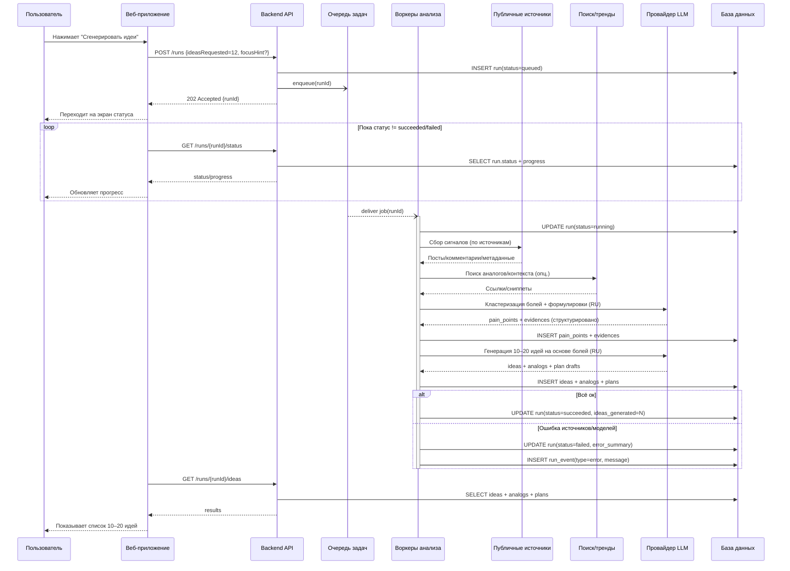
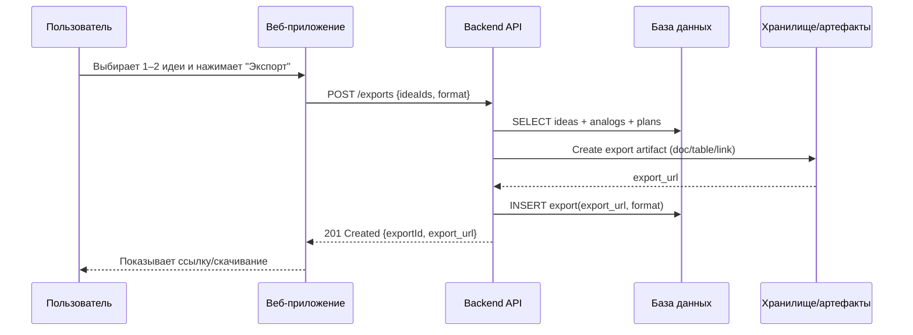
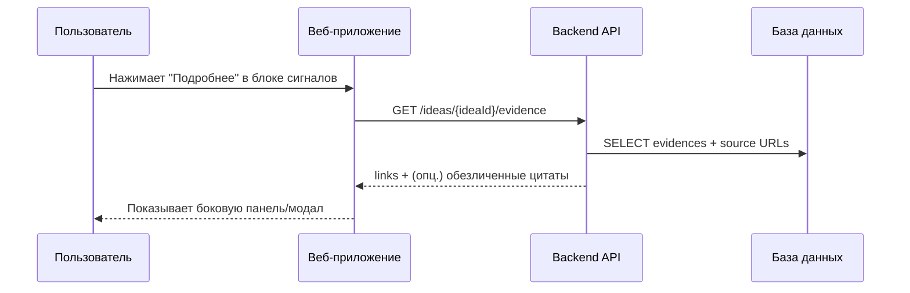

# Sequence Diagrams: Генератор болей → бизнес-идеи

> Основано на: USM v1.0, C4 v1.0, API Inventory v1.0

## Обзор

| # | Сценарий | Сложность | Участники |
|---|----------|-----------|-----------|
| 1 | Запуск прогона и получение 10–20 идей | Высокая | Пользователь, Веб, API, Очередь, Воркеры, Источники, Поиск/тренды, LLM, БД |
| 2 | Экспорт выбранных идей | Средняя | Пользователь, Веб, API, Хранилище, БД |

---

## 1. Запуск прогона и получение 10–20 идей

### Контекст

**User Story:** US-001, US-003, US-005, US-006, US-007  
**Идея:** UI не должен “висеть”, прогон асинхронный; важны статус и прозрачность.

### Диаграмма

### Примечания

- Прогресс лучше считать по этапам: “сбор сигналов → формулировка болей → генерация идей → аналоги → план”.
- При деградации качества важно честно помечать: “аналоги требуют проверки / источники недоступны”.

---

## 2. Экспорт выбранных идей

### Контекст

**User Story:** US-010  
**Цель:** быстро получить документ/таблицу/ссылку для обсуждения.

### Диаграмма

---

## 3. “Подробнее” по доказательствам (по кнопке на странице идеи)

### Контекст

**User Story:** US-005 (режим “не перегружать” + детали по запросу)  
**Цель:** по умолчанию показывать только паттерны, а ссылки/цитаты/обсуждения — по явному действию.

### Диаграмма

---

## Приложения

### Участники (из C4)

| ID | Название | Тип | Описание |
|----|----------|-----|----------|
| W | Веб‑приложение | Container | UI на русском |
| A | Backend API | Container | Оркестрация и данные |
| Q | Очередь | Container | Асинхронные задачи |
| X | Воркеры | Container | Анализ и генерация |
| S/T/L | Внешние | System_Ext | Источники/поиск/LLM |

### Соглашения

- `->>` / `-->>` — синхронные
- `-)` / `--)` — асинхронные
- `alt/else` — ветвления ошибок
