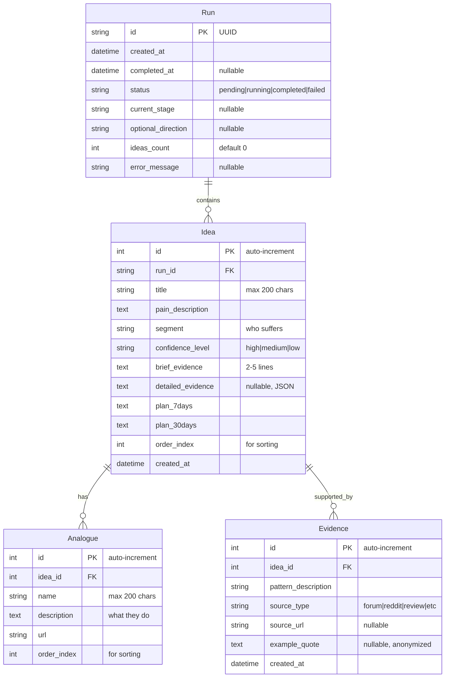

# Data Model: Pain-to-Idea Generator MVP

**Date**: 2026-02-04
**Feature**: 001-pain-to-idea-mvp
**Database**: SQLite (file-based)

## Entity Relationship Diagram



## Entity Definitions

### Run

Represents a single generation session initiated by a user.

**Fields**:

| Field | Type | Nullable | Default | Description |
|-------|------|----------|---------|-------------|
| id | UUID | No | gen_uuid() | Unique run identifier |
| created_at | DateTime | No | now() | When run was initiated |
| completed_at | DateTime | Yes | NULL | When run finished (success or failure) |
| status | Enum | No | 'pending' | Current status: pending, running, completed, failed |
| current_stage | String(100) | Yes | NULL | Human-readable stage in Russian |
| optional_direction | String(500) | Yes | NULL | User-provided focus direction |
| ideas_count | Integer | No | 0 | Number of ideas generated |
| error_message | Text | Yes | NULL | Error details if status=failed |

**Status Transitions**:
```
pending → running → completed
pending → running → failed
```

**Stages (examples in Russian)**:
- "Поиск сигналов"
- "Анализ болей"
- "Генерация идей"
- "Поиск аналогов"
- "Создание планов"
- "Завершение"

**Validation Rules**:
- `id` must be valid UUID v4
- `status` must be one of: pending, running, completed, failed
- `current_stage` max 100 characters
- `optional_direction` max 500 characters
- If `status=completed`, `completed_at` must not be NULL
- If `status=completed`, `ideas_count` must be >= 10 (per FR-007)

**Indexes**:
- Primary key: `id`
- Index on: `created_at` (for cleanup of old runs)
- Index on: `status` (for worker queries)

**Relationships**:
- Has many `Idea` (1:N)

---

### Idea

A single business idea generated from a pain point.

**Fields**:

| Field | Type | Nullable | Default | Description |
|-------|------|----------|---------|-------------|
| id | Integer | No | auto | Primary key |
| run_id | UUID | No | - | Foreign key to Run |
| title | String(200) | No | - | Idea name in Russian |
| pain_description | Text | No | - | 1 paragraph description of pain |
| segment | String(200) | No | - | Who suffers (e.g., "Стартапы 0→1") |
| confidence_level | Enum | No | - | high, medium, low |
| brief_evidence | Text | No | - | 2-5 lines of patterns |
| detailed_evidence | JSON | Yes | NULL | Structured evidence data |
| plan_7days | Text | No | - | 7-day implementation plan |
| plan_30days | Text | No | - | 30-day implementation plan |
| order_index | Integer | No | 0 | Display order within run |
| created_at | DateTime | No | now() | When idea was generated |

**Validation Rules**:
- `title` max 200 characters, required, in Russian
- `pain_description` min 50 characters, max 2000 characters
- `segment` max 200 characters, required
- `confidence_level` must be one of: high, medium, low
- `brief_evidence` min 20 characters (at least 2-5 lines)
- `plan_7days` and `plan_30days` min 50 characters each
- `order_index` >= 0

**JSON Schema for detailed_evidence**:
```json
{
  "sources": [
    {"type": "forum", "url": "https://...", "context": "..."}
  ],
  "quotes": [
    {"text": "Anonymized quote...", "source": "reddit"}
  ],
  "signal_strength": "high|medium|low"
}
```

**Indexes**:
- Primary key: `id`
- Foreign key: `run_id` references Run(id) ON DELETE CASCADE
- Index on: `(run_id, order_index)` for sorted retrieval

**Relationships**:
- Belongs to `Run` (N:1)
- Has many `Analogue` (1:N)
- Has many `Evidence` (1:N)

---

### Analogue

A competitor or existing solution related to an idea.

**Fields**:

| Field | Type | Nullable | Default | Description |
|-------|------|----------|---------|-------------|
| id | Integer | No | auto | Primary key |
| idea_id | Integer | No | - | Foreign key to Idea |
| name | String(200) | No | - | Product/company name |
| description | Text | No | - | What they do |
| url | String(500) | No | - | Link to product/website |
| order_index | Integer | No | 0 | Display order |

**Validation Rules**:
- `name` max 200 characters, required
- `description` min 20 characters, max 1000 characters
- `url` must be valid URL format
- Each `Idea` must have at least 2 `Analogue` records (per FR-009)
- `order_index` >= 0

**Indexes**:
- Primary key: `id`
- Foreign key: `idea_id` references Idea(id) ON DELETE CASCADE
- Index on: `(idea_id, order_index)`

**Relationships**:
- Belongs to `Idea` (N:1)

---

### Evidence

Supporting evidence for a pain point (detailed view only).

**Fields**:

| Field | Type | Nullable | Default | Description |
|-------|------|----------|---------|-------------|
| id | Integer | No | auto | Primary key |
| idea_id | Integer | No | - | Foreign key to Idea |
| pattern_description | Text | No | - | Observed pattern/signal |
| source_type | String(50) | No | - | Type of source |
| source_url | String(500) | Yes | NULL | Link to source |
| example_quote | Text | Yes | NULL | Anonymized example |
| created_at | DateTime | No | now() | When evidence was recorded |

**Validation Rules**:
- `pattern_description` min 20 characters
- `source_type` examples: "forum", "reddit", "review", "twitter", "community"
- `source_url` must be valid URL if provided
- `example_quote` should be anonymized (no personal names)

**Indexes**:
- Primary key: `id`
- Foreign key: `idea_id` references Idea(id) ON DELETE CASCADE
- Index on: `idea_id`

**Relationships**:
- Belongs to `Idea` (N:1)

---

## Database Schema (SQLite SQL)

```sql
-- Run table
CREATE TABLE runs (
    id TEXT PRIMARY KEY,  -- UUID as text
    created_at DATETIME NOT NULL DEFAULT CURRENT_TIMESTAMP,
    completed_at DATETIME,
    status TEXT NOT NULL DEFAULT 'pending' CHECK(status IN ('pending', 'running', 'completed', 'failed')),
    current_stage TEXT,
    optional_direction TEXT,
    ideas_count INTEGER NOT NULL DEFAULT 0,
    error_message TEXT
);

CREATE INDEX idx_runs_created_at ON runs(created_at);
CREATE INDEX idx_runs_status ON runs(status);

-- Idea table
CREATE TABLE ideas (
    id INTEGER PRIMARY KEY AUTOINCREMENT,
    run_id TEXT NOT NULL,
    title TEXT NOT NULL,
    pain_description TEXT NOT NULL,
    segment TEXT NOT NULL,
    confidence_level TEXT NOT NULL CHECK(confidence_level IN ('high', 'medium', 'low')),
    brief_evidence TEXT NOT NULL,
    detailed_evidence TEXT,  -- JSON
    plan_7days TEXT NOT NULL,
    plan_30days TEXT NOT NULL,
    order_index INTEGER NOT NULL DEFAULT 0,
    created_at DATETIME NOT NULL DEFAULT CURRENT_TIMESTAMP,
    FOREIGN KEY (run_id) REFERENCES runs(id) ON DELETE CASCADE
);

CREATE INDEX idx_ideas_run_id ON ideas(run_id, order_index);

-- Analogue table
CREATE TABLE analogues (
    id INTEGER PRIMARY KEY AUTOINCREMENT,
    idea_id INTEGER NOT NULL,
    name TEXT NOT NULL,
    description TEXT NOT NULL,
    url TEXT NOT NULL,
    order_index INTEGER NOT NULL DEFAULT 0,
    FOREIGN KEY (idea_id) REFERENCES ideas(id) ON DELETE CASCADE
);

CREATE INDEX idx_analogues_idea_id ON analogues(idea_id, order_index);

-- Evidence table
CREATE TABLE evidences (
    id INTEGER PRIMARY KEY AUTOINCREMENT,
    idea_id INTEGER NOT NULL,
    pattern_description TEXT NOT NULL,
    source_type TEXT NOT NULL,
    source_url TEXT,
    example_quote TEXT,
    created_at DATETIME NOT NULL DEFAULT CURRENT_TIMESTAMP,
    FOREIGN KEY (idea_id) REFERENCES ideas(id) ON DELETE CASCADE
);

CREATE INDEX idx_evidences_idea_id ON evidences(idea_id);
```

## Data Access Patterns

### Common Queries

**1. Create new run**:
```sql
INSERT INTO runs (id, status) VALUES ('uuid-here', 'pending');
```

**2. Get run with all ideas**:
```sql
SELECT * FROM runs WHERE id = ?;
SELECT * FROM ideas WHERE run_id = ? ORDER BY order_index;
```

**3. Get idea with analogues and evidence**:
```sql
SELECT * FROM ideas WHERE id = ?;
SELECT * FROM analogues WHERE idea_id = ? ORDER BY order_index;
SELECT * FROM evidences WHERE idea_id = ?;
```

**4. Update run progress**:
```sql
UPDATE runs SET status = 'running', current_stage = ? WHERE id = ?;
```

**5. Complete run**:
```sql
UPDATE runs SET status = 'completed', completed_at = CURRENT_TIMESTAMP, ideas_count = ? WHERE id = ?;
```

**6. Cleanup old runs (24+ hours)**:
```sql
DELETE FROM runs WHERE created_at < datetime('now', '-24 hours');
-- CASCADE will delete related ideas, analogues, evidences
```

## Data Integrity Rules

### Application-Level Validations

1. **Idea completeness**: Before marking run as completed:
   - Each idea must have title, pain_description, segment, brief_evidence, plan_7days, plan_30days
   - Each idea must have confidence_level set
   - Each idea must have at least 2 analogues (per FR-009)

2. **Language validation**: All user-facing text fields must be in Russian:
   - title, pain_description, segment, brief_evidence, plan_7days, plan_30days
   - Exception: analogue.name may be in original language (brand name)

3. **Count validation**: Run must generate 10-20 ideas (per FR-007):
   - If worker generates <10 ideas, mark run as failed
   - If worker generates >20 ideas, take top 20 by confidence

### Database Constraints

- Foreign key constraints with CASCADE delete
- Enum validation for status, confidence_level
- NOT NULL constraints on critical fields
- CHECK constraints where applicable

## Migration Strategy

### Initial Schema (v1)

Run migration script on first deployment:
```python
# backend/src/models/migrations/001_initial_schema.sql
```

### Rollback Plan

For MVP with 24-hour retention, no complex migration needed:
- If schema changes required, can drop and recreate (no persistent data)
- For post-MVP: Use Alembic for migrations

## Data Retention Policy

Per NFR and Constitution:

- **Minimum retention**: 24 hours (FR-015)
- **Cleanup frequency**: Daily cron job at 3 AM UTC
- **Cleanup logic**: Delete runs older than 24 hours
- **Post-MVP**: Extend to 7 days retention

## Performance Considerations

### MVP Scale (50 concurrent users)

- **Estimated DB size**: ~500 MB for 1000 runs @ 15 ideas each
- **SQLite limits**: Handles this easily (tested up to 100 GB)
- **Bottleneck**: Not DB, but LLM API calls

### Indexes Strategy

- Minimal indexes for MVP (listed above)
- SQLite query planner handles small datasets efficiently
- No need for complex optimization at this scale

## Testing Considerations

### Data Fixtures for Testing

Create sample data:
```python
# tests/fixtures/sample_run.json
{
  "id": "test-uuid-123",
  "status": "completed",
  "ideas_count": 12,
  "ideas": [
    {
      "title": "Тестовая идея",
      "pain_description": "Описание боли...",
      ...
    }
  ]
}
```

### Validation Tests

1. Test foreign key constraints work
2. Test CASCADE delete removes related records
3. Test CHECK constraints reject invalid enum values
4. Test idea count validation (10-20 range)
